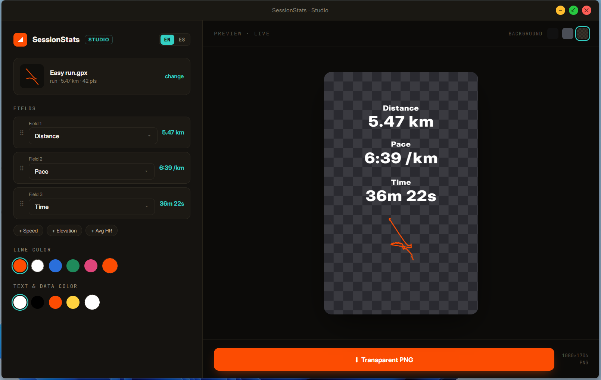

# SessionStats

Turn a GPX or FIT workout into a stats image with a transparent background, ready to place on top of your photos. It runs entirely on your PC: no account, no upload, no Internet connection.


## Download

Get `SessionStats.exe` from the [Releases](../../releases) page and run it. No installation needed.

Windows may show *"Windows protected your PC"* because the executable is not signed: click **More info → Run anyway**.
Each release lists the SHA-256 hash of the file so you can check it.

Requires Windows 10/11 with the Microsoft Edge WebView2 runtime (already included in Windows 11).

## Run from source

```
pip install -r requirements.txt
python src/sessionstats.py
```

Build the executable with `pip install -r requirements-dev.txt` and `pyinstaller SessionStats.spec`. Run the tests with `python -m pytest`.

## Privacy

Your files are read locally and never leave your computer. The app opens no network port (no local web server) and makes no Internet requests.
